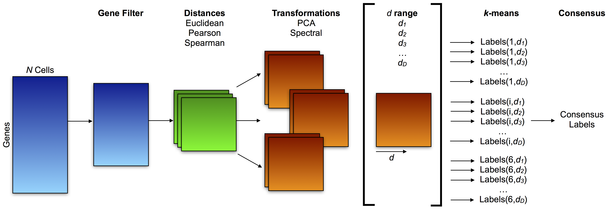

### NEWS

_25/11/2015_

Started writing a manual. Meanwhile, if you have any questions on the usage of SC3 please send your questions to [Vladimir Kiselev](mailto:vk6@sanger.ac.uk).

_24/11/2015_

SC3 (<b>S</b>ingle-<b>C</b>ell <b>C</b>onsensus <b>C</b>lustering) is an interactive tool (implemented as an R package) for the unsupervised clustering of cells from single cell RNA-Seq experiments.

Please keep in mind that this is a developmental version of SC3 and some of the functionality may not work on some systems (currently completely tested on MacOS only). We are in the process of submitting SC3 to Bioconductor. Once it is done we will provide a link to it here. If you have any problems with the installation or running SC3, please contact [Vladimir Kiselev](mailto:vk6@sanger.ac.uk).

We are also in the process of submitting the manuscript, describing SC3, to a journal. Meanwhile, if you need more technical details of the tool, please send a request to [Vladimir Kiselev](mailto:vk6@sanger.ac.uk) and he will share the technical part of the manuscript with you.

There is also a poster and a presentation available (note, that they are already a couple of months old):

[SC3 poster](http://f1000research.com/posters/4-1182)

[SC3 presentation](https://speakerdeck.com/wikiselev/sc3-consensus-clustering-of-single-cell-rna-seq-data)

### 1. Installation

Start R and then type:

```{R}
install.packages("devtools")
devtools::install_github("hemberg-lab/SC3")
library(SC3)
RSelenium::checkForServer()
```

### 2. Test run

To test that the package has been installed successfully please run the following command:

```{R}
library(SC3)
sc3(treutlein, ks = 3:7, cell.filter = TRUE)
```

It should open SC3 in a browser window without providing any error. If there is any error please send it to [Vladimir Kiselev](mailto:vk6@sanger.ac.uk).

### 3. "Built-in" datasets

There are two built-in datasets that are automatically loaded with SC3:

| Dataset | Source | __N__ cells | __k__ clusters |
--- | --- | --- | --- |
| [Treutlein](http://www.nature.com/nature/journal/v509/n7500/full/nature13173.html) | Distal lung epithelium | 80 | 5 |
| [Deng](http://www.sciencemag.org/content/343/6167/193) | Mouse embryos | 268 | 10 |

One can explore clusterings of these datasets by running the following commands (__ks__ parameter defines a region of __k__ needed to be investigated - see the next paragraph):

```{R}
sc3(treutlein, ks = 3:7)
sc3(deng, ks = 8:12)
```

### 4. Running SC3

The SC3 pipeline:


To run SC3 please use the following function:

```{R}
sc3(dataset, ks = k.min:k.max,
    cell.filter = FALSE, cell.filter.genes = 2000,
    interactivity = TRUE,
    svm.num.cells = 1000,
    show.original.labels = FALSE,
    d.region.min = 0.04,
    d.region.max = 0.07,
    chisq.quantile = 0.9999)
```

* __dataset__ is either an R matrix / data.frame / data.table object OR a path to your input file containing an expression matrix.
* __ks__ is a range of the number of clusters that needs to be tested. __k.min__ is the minimum number of clusters (default is 3). __k.max__ is the maximum number of clusters (default is 7). 
* (optional) __cell.filter__ is used to filter cells that express less than __cell.filter.genes__ genes (_lowly expressed cells_). By default it is OFF. To switch it ON please use __TRUE__ value as in the __Test run__ above. Should be used if it is not possible to properly cluster original cells - filtering of _lowly expressed cells_ usually improves clustering.
* (optional) __cell.filter.genes__ - if __cell.filter__ is used then this parameter defines the minimum number of genes that have to be expressed in each cell (i.e. have more than zero reads). If there are fewer, the cell will be removed from the analysis. The default is 2000.
* (optional) __interactivity__ defines whether a browser interactive window should be open after all computation is done. By default it is ON. To switch it OFF please use __FALSE__ value. This option can be used to separate clustering calculations from visualisation, e.g. long and time-consuming clustering of really big datasets can be run on a computing cluster and visualisations can be done using a personal laptop afterwards. If __interactivity__ is OFF then all clustering results will be saved to __dataset__.rds file. To run interactive visulisation with the precomputed clustering results please use `sc3_interactive(readRDS("dataset.rds"))`.
* (optional) __svm.num.cells__ - if number of cells in your dataset is greater than this parameter, then an SVM prediction will be used. The default is 1000.
* (optional) __show.original.labels__ - if cell labels in the __dataset__ are not unique, but represent clusters expected from the experiment, they can be visualised by setting __show.original.labels__ to __TRUE__. The default is __FALSE__.
* (optional) __d.region.min__ - the lower boundary of the optimum region of __d__. The default is 0.04.
* (optional) __d.region.max__ - the upper boundary of the optimum region of __d__. The default is 0.07.
* (optional) __chisq.quantile__ - a treshold used for cell outliers detection. The default is 0.9999.

Usage example: if you would like to check clustering of your __dataset__ for __ks__ from 2 to 5, then you need to run the following:

```{R}
sc3(dataset, ks = 2:5)                        # without filtering of lowly expressed cells
sc3(dataset, ks = 2:5, cell.filter = TRUE)    # with filtering of lowly expressed cells
sc3(dataset, ks = 2:5, interactivity = FALSE) # without interactive visualisation
```

### 5. Input file format

To run SC3 on an input file containing an expression matrix one need to preprocess the input file so that it looks as follows:


|  | cell1 | cell2 | cell3 | cell4 | cell5 
--- | --- | --- | --- | --- | ---
| __gene1__ | 1 | 2 | 3 | 4 | 5 
| __gene2__ | 1 | 2 | 3 | 4 | 5 
| __gene3__ | 1 | 2 | 3 | 4 | 5 


The first row of the expression matrix (with cell labels, e.g. __cell1__, __cell2__, etc.) should contain one fewer field than all other rows. Separators should be either spaces or tabs. If separators are commas (,) then the extension of the file must be .csv. If a path to your input file is "/path/to/input/file/expression-matrix.txt", to run it:

```{R}
sc3("/path/to/input/file/expression-matrix.txt", ks = 2:5)
```

### 6. Licence

GPL-3

test
